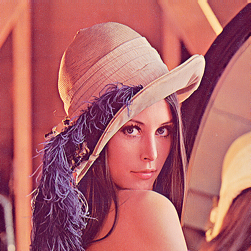
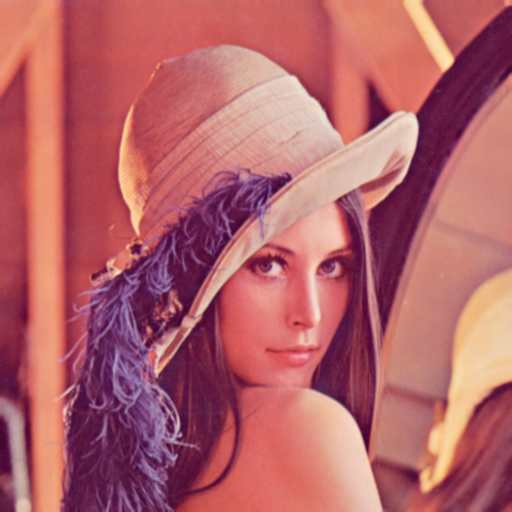
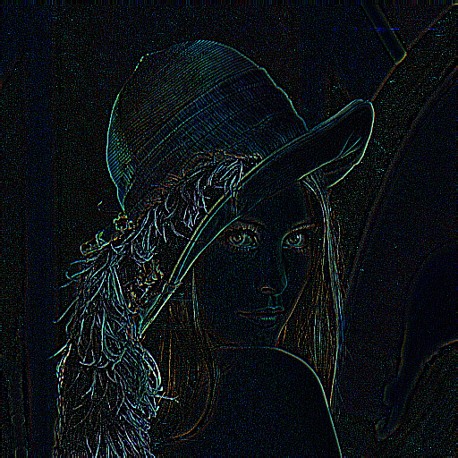

# GO GRAPHICS

## Image Processing

The processing package provides the function `TransformImage` which takes an `Image`, and `Kernel` structs as parameters and returns a pointer to `RGBA` struct.

TransformImage Type Declaration

```
func TransformImage(i image.Image, k *kernels.Kernel) *image.RGBA
```

`Image` and `RGBA` structs are provided by the `image` package from the standard library. `Kernel` on the other hand is supplied by the kernel package of this library.

## Supported Formats

Three formats are supported by the processing package (png, jpeg and jpg). The formats package supplies the function `IsSupportedFormat` which takes a string and returns a boolean value.

## Kernels

Four basic kernels are provided by the kernel package:

#### Example Transformations

### Original Image


### Sharpen Kernel



### GaussianBlur Kernel



### EdgeDetection Kernel

When applied on an image transformation, the resulting image displays the edges of objects in the image.



### BoxBlur Kernel


### Custom Kernel

A custom kernel can be used by implementing the Kernel struct from the kernels package. This struct contains the field Kernel which is a three by three matrix of float32 values.
